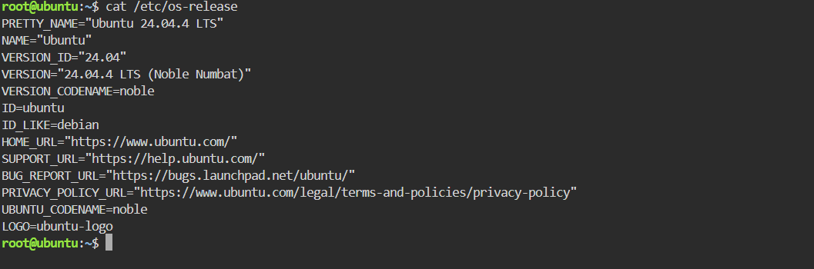
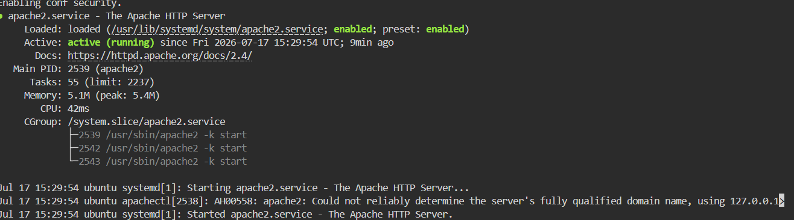
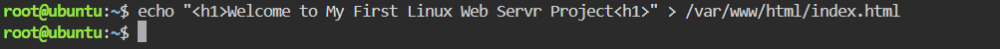
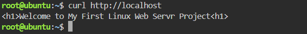
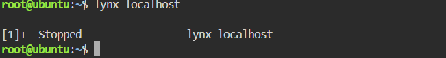
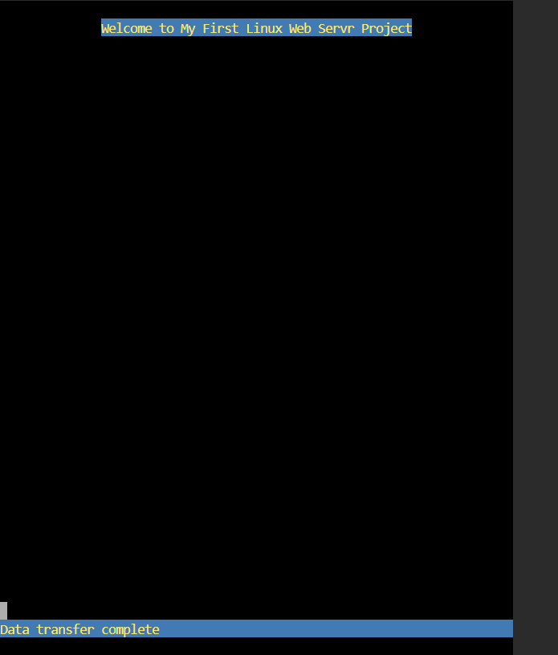

# Linux-Web-Server-Project

## Project Overview

This project demonstrates how to install, configure, and verify an Apache Web Server on Ubuntu 24.04.4 LTS using Killercoda.

## Objective

The objectives of this project are to:

- Learn package management using `apt`
- Install the Apache web server
- Verify that the Apache service is running
- Create a custom web page
- Test the web server using `curl` and `lynx`

## Environment

| Component | Details |
|----------|---------|
| Platform | Killercoda |
| Operating System | Ubuntu 24.04.4 LTS |
| Web Server | Apache2 |

## Installation

Update the package list:

```bash
apt update
```

Install Apache:

```bash
apt install apache2 -y
```

Verify that Apache is running:

```bash
systemctl status apache2
```

## Create a Custom Web Page

```bash
echo "<h1>Welcome to My First Linux Web Server Project</h1>" > /var/www/html/index.html
```

## Verification

Verify using curl:

```bash
curl http://localhost
```

Verify using Lynx:

```bash
lynx localhost
```

## What I Learned

- Installing software using `apt`
- Managing services with `systemctl`
- Understanding Apache's document root (`/var/www/html`)
- Creating a basic HTML web page
- Verifying a web server using `curl` and `lynx`

- ## Challenges Faced

- Accidentally typed `<hi>` instead of `<h1>` and learned how to correct it.
- Learned why Apache serves web pages from `/var/www/html`.
- Verified the web server using both `curl` and `lynx`.

## Screenshots

### Operating System Information



### Apache Service Status



### Creating the Custom Web Page



### Verifying with curl



### Verifying with lynx



### Verifying with lynx


## Conclusion

This project helped me understand the basic installation, configuration, and verification of an Apache Web Server on Ubuntu using Killercoda.
